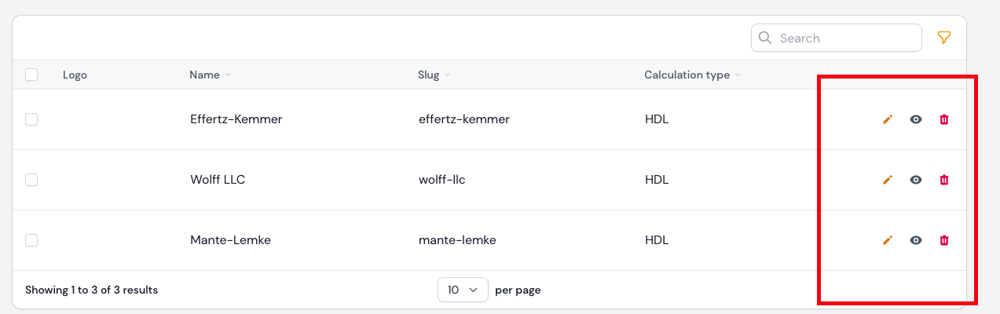
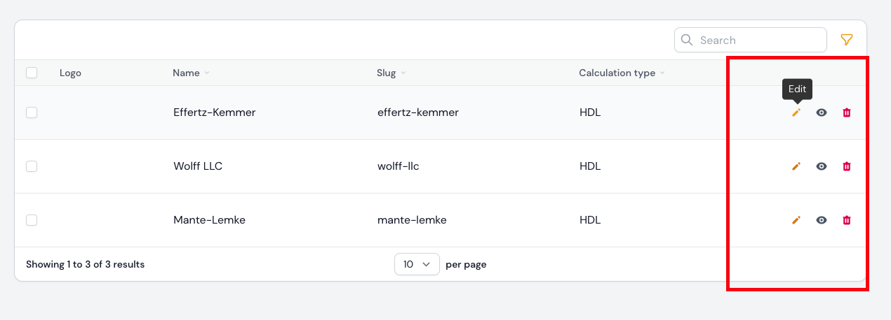

[](https://github.com/Maggomann/filament-only-icon-display/actions?query=workflow%3Arun-tests+branch%3Amain) [](https://github.com/Maggomann/filament-only-icon-display/blob/main/LICENSE.md) [](https://packagist.org/packages/maggomann/filament-only-icon-display)
---

# Filament only icon display package for filament v2.x
This package is tailored for [Filament Admin Panel v2.x](https://filamentphp.com/docs/2.x/admin/installation).

Make sure you have installed the admin panel before you continue with the installation. You can check the [documentation here](https://filamentphp.com/docs/2.x/admin/installation)

The package provides the `HasOnlyIcon` trait for [Filament Admin Panel v2.x](https://filamentphp.com/docs/2.x/admin/installation). With this trait it is possible to display the table actions buttons only as icon or optionally only as icon including tooltip. The package currently provides the table action buttons (`CreateAction`, `DeleteAction`, `EditAction` and `ViewAction`) that already contain the trait. Own table action buttons can be extended with the `HasOnlyIcon` €trait, so that the methods are then available.





## Supported Versions

PHP: `8.1`

Laravel: `9`

## Installation

You can install the package via composer:

```console
composer require maggomann/filament-only-icon-display
```

## How is it used?

Use the supplied classes in your filament project as usual

```php

use Filament\Resources\RelationManagers\RelationManager;
use Maggomann\FilamentOnlyIconDisplay\Domain\Tables\Actions\CreateAction;
use Maggomann\FilamentOnlyIconDisplay\Domain\Tables\Actions\DeleteAction;
use Maggomann\FilamentOnlyIconDisplay\Domain\Tables\Actions\EditAction;
use Maggomann\FilamentOnlyIconDisplay\Domain\Tables\Actions\ViewAction;

class YourRelationManager extends RelationManager
{
    public static function table(Table $table): Table
    {
        return $table
            ->actions([
                CreateAction::make()->onlyIconAndTooltip(), // show icon and tooltip with the content of $this->name
                EditAction::make()->onlyIconAndTooltip(), // show icon and tooltip with the content of $this->name
                ViewAction::make()->onlyIconAndTooltip(), // show icon and tooltip with the content of $this->name
                DeleteAction::make()->onlyIconAndTooltip(), // show icon and tooltip with the content of $this->name
            ])
        //....

    }
}
```

Or use your own table action class

```php

use Filament\Tables\Actions\Action;
use Maggomann\FilamentOnlyIconDisplay\Domain\Tables\Traits\HasOnlyIcon;

class YourOwnAction extends Action
{
    use HasOnlyIcon;
}

// ...
// ...
// ...

use Filament\Resources\RelationManagers\RelationManager;
use YourOwnAction;

class YourRelationManager extends RelationManager
{
    public static function table(Table $table): Table
    {
        return $table
            ->actions([
                YourOwnAction::make('you need a name')->onlyIconAndTooltip(),
            ])
        //....

    }
}

```

### onlyIconAndTooltip() method

Displays only the icon including the tooltip.

```php

use Filament\Tables\Actions\Action;
use Maggomann\FilamentOnlyIconDisplay\Domain\Tables\Traits\HasOnlyIcon;

class YourOwnAction extends Action
{
    use HasOnlyIcon;
}

YourOwnAction::make('my name')->onlyIconAndTooltip(), // tooltip content: my name
YourOwnAction::make('my name')
    ->label('my label')
    ->onlyIconAndTooltip(), // tooltip content: my label
YourOwnAction::make('my name')
    ->label('my label')
    ->tooltip('my tooltip')
    ->onlyIconAndTooltip(), // tooltip content: my tooltip

```

### onlyIcon() method

Displays only the icon without the tooltip, no matter what label, name or tooltip they provide with the classic method names.

```php

use Filament\Tables\Actions\Action;
use Maggomann\FilamentOnlyIconDisplay\Domain\Tables\Traits\HasOnlyIcon;

class YourOwnAction extends Action
{
    use HasOnlyIcon;
}

YourOwnAction::make('my name')->onlyIcon(), // tooltip content: no content
YourOwnAction::make('my name')
    ->label('my label')
    ->onlyIcon(), // tooltip content: no content
YourOwnAction::make('my name')
    ->label('my label')
    ->tooltip('my tooltip')
    ->onlyIcon(), // tooltip content: no content
```

## Testing

```bash
composer test
composer test:pest-coverage
```

## Changelog

Please see [CHANGELOG](CHANGELOG.md) for more information on what has changed recently.

## Contributing

Please see [CONTRIBUTING](.github/CONTRIBUTING.md) for details.

## Security Vulnerabilities

Please review [our security policy](../../security/policy) on how to report security vulnerabilities.

## Credits

- [Marco Ehrt](https://github.com/Maggomann)
- [All Contributors](../../contributors)

## License

The MIT License (MIT). Please see [License File](LICENSE.md) for more information.

## Disclaimer

**Please note that these packages for Filament are not officially operated by Filament and do not provide any support or warranty from the Filament team. The use of these packages is at your own risk.**

This project represents unofficial extensions for Filament and is maintained by an independent community of developers. We strive to maintain compatibility with the current versions of Filament, but we cannot guarantee that the packages will function flawlessly or be compatible with future versions of Filament.

We recommend users to create backups of their projects and thoroughly test them before using these packages. If you have any questions, issues, or suggestions, we are available to assist you. However, please note that we cannot provide official support for these packages.

We would like to emphasize that Filament is a separate developer community independent of this project. For more information about Filament, please refer to the official Filament website.

Please read the license terms to learn more about the conditions for using these packages.
